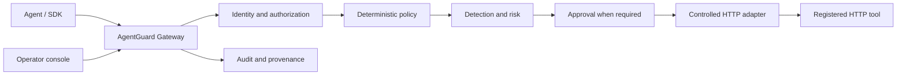
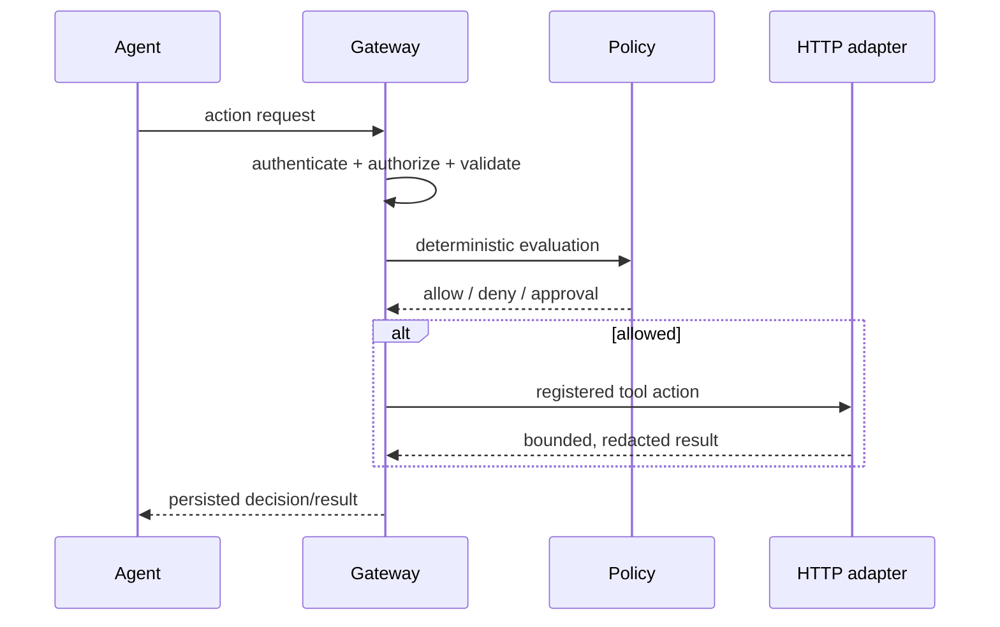

<div align="center">

# 🛡️ AgentGuard

**A server-authoritative security gateway for autonomous AI agents.**

Every registered agent action is evaluated by the backend *before* a registered tool is
allowed to execute it. The operator dashboard is a window into that process — never
part of the authorization path.

[](LICENSE)
[](pyproject.toml)
[](package.json)
[](backend/src/agentguard/main.py)
[](frontend/package.json)
[](.github/workflows/ci.yml)

</div>

> [!IMPORTANT]
> **This is Phase 1.** It establishes the project's foundation — repo structure, local
> dev environment, CI, health/readiness endpoints, and documentation. It does **not**
> yet provide agent registration, policy enforcement, tool execution, approvals, audit
> chains, or production authentication. Nothing in this phase makes access-control
> decisions.

---

## Why AgentGuard

As agents get more autonomy — calling tools, hitting APIs, touching production data —
the question stops being "what can this model say" and becomes **"what is this agent
allowed to *do*, and who checked?"** AgentGuard is being built to answer that as a
deny-by-default control plane that sits between agents and the tools they call:

- **Server-authoritative** — decisions are made and enforced on the backend. A
  compromised or jailbroken agent client cannot talk itself past policy.
- **Deny by default** — nothing executes without an explicit, evaluated decision.
- **Untrusted by default** — LLM output, tool descriptions, arguments, and external
  content are all treated as untrusted input, not instructions.
- **Separation of concerns** — policy decisions, human approvals, and execution are
  distinct responsibilities, so no single step can quietly grant itself more power.
- **Auditable** — every decision is designed to leave a structured, redacted,
  append-only trail.

The dashboard shown below is an **operator interface**, not a security authority — it
observes and manages the system, it never decides on its own.

## Where this is headed



The planned request lifecycle: **authenticate → authorize → validate the pinned tool
schema → evaluate deterministic policy → detect threats & sensitive data → assess risk
→ request approval when required → persist the decision → execute a registered HTTP
adapter → append audit/provenance records.**



Read more in [Architecture overview](docs/architecture/overview.md),
[Security flow](docs/architecture/security-flow.md), and
[ADR 0001 — modular monolith](docs/decisions/0001-modular-monolith.md).

## What's actually built in Phase 1

| Area | Status |
|---|---|
| Repo structure, tooling, CI | ✅ Done |
| FastAPI app with health/readiness endpoints | ✅ Done |
| Structured, redacted logging + request correlation IDs | ✅ Done |
| Security headers, restrictive CORS, trusted-host middleware | ✅ Done |
| Postgres + Redis via Docker Compose, Alembic migrations | ✅ Done |
| Next.js operator console shell (dashboard, agents, tools, policies, approvals, incidents, activity, settings) | ✅ Scaffolded |
| Python SDK client scaffold | ✅ Scaffolded |
| Agent registration, policy engine, tool execution | ⏳ Not yet |
| Approvals, audit chain, provenance | ⏳ Not yet |
| Production authentication | ⏳ Not yet |

## Project layout

```
agentguard/
├── backend/            FastAPI service (agentguard package), Alembic migrations
├── frontend/           Next.js operator console
├── sdk/python/         Python client SDK for agents
├── demo/                Example agent(s) exercising the SDK
├── docs/                Architecture, security, and deployment documentation
└── compose.yaml         Postgres, Redis, backend, and frontend for local dev
```

## Getting started

**Prerequisites:** Git, Python 3.12+, Node.js LTS (≥22), Docker Desktop with Compose,
and GNU Make (or a compatible `make`).

```sh
git clone <repository-url> agentguard
cd agentguard
cp .env.example .env      # Windows: Copy-Item .env.example .env
corepack enable
pnpm install
make dev
```

Once the stack is up:

- Backend health check → `http://localhost:8000/api/v1/health`
- Operator console → `http://localhost:3000/dashboard`

> Replace the default local PostgreSQL password in `.env` before exposing the stack
> beyond your own machine.

### Everyday commands

```sh
make dev          # start the full stack with Docker Compose
make format       # ruff format (backend/sdk) + frontend formatter
make lint         # ruff check (backend/sdk) + eslint (frontend)
make typecheck    # mypy (backend/sdk) + tsc (frontend)
make test         # pytest (backend/sdk) + frontend tests
make db-migrate   # apply Alembic migrations inside the backend container
make db-reset     # drop volumes, restart postgres/redis, and re-migrate
```

No `make` available? See the equivalent raw commands in
[`docs/development/local-setup.md`](docs/development/local-setup.md).

## Security

AgentGuard is a security product, so its own posture matters:

- Deny by default; the backend is the sole authoritative enforcement layer.
- LLM output, tool descriptions, arguments, and external content are always treated
  as untrusted.
- Tools are registered, typed, and — for now — restricted to HTTP only.
- No arbitrary command, filesystem, browser, database, or subprocess execution.
- Structured, redacted logs with correlation IDs; credentials are never logged.

See [Security principles](docs/security/security-principles.md),
[Threat model](docs/security/threat-model.md), and
[`SECURITY.md`](SECURITY.md) for how to report a vulnerability.

## Documentation

- [Architecture overview](docs/architecture/overview.md)
- [Security flow](docs/architecture/security-flow.md)
- [Data model direction](docs/architecture/data-model.md)
- [Security principles](docs/security/security-principles.md)
- [Threat model](docs/security/threat-model.md)
- [Local setup](docs/development/local-setup.md)
- [Deployment (local)](docs/deployment/local.md)
- [ADR 0001 — modular monolith](docs/decisions/0001-modular-monolith.md)

## Contributing

Contributions are welcome — see [`CONTRIBUTING.md`](CONTRIBUTING.md) and please follow
the [`CODE_OF_CONDUCT.md`](CODE_OF_CONDUCT.md).

## License

Licensed under the [Apache License 2.0](LICENSE).
