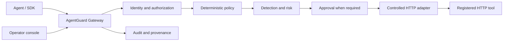

# Architecture overview

AgentGuard is a modular monolith that provides a server-authoritative control
plane between autonomous agents and registered tools. Phase 1 establishes its
local development structure only.

The dashboard is never on the authorization or execution path. Future modules
remain in-process initially so their interfaces and database transactions can
be tested together; they may be separated only when an isolation boundary
requires it.
