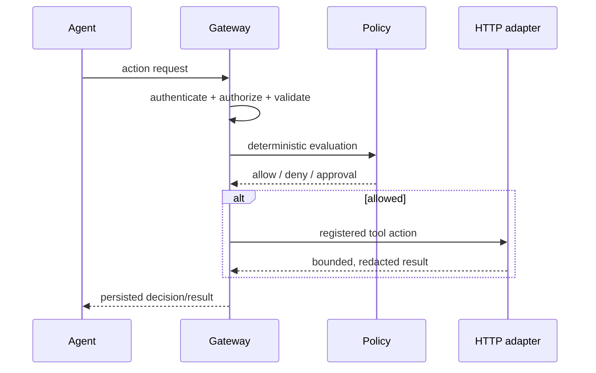

# Security flow

The future gateway sequence is: authenticate, authorize, validate the pinned
tool schema, evaluate deterministic policy, detect threats and sensitive data,
assess risk, request approval when required, persist a decision, execute a
registered HTTP adapter, and append audit/provenance records.

Phase 1 implements only health/readiness infrastructure. It does not yet
evaluate or execute actions.
